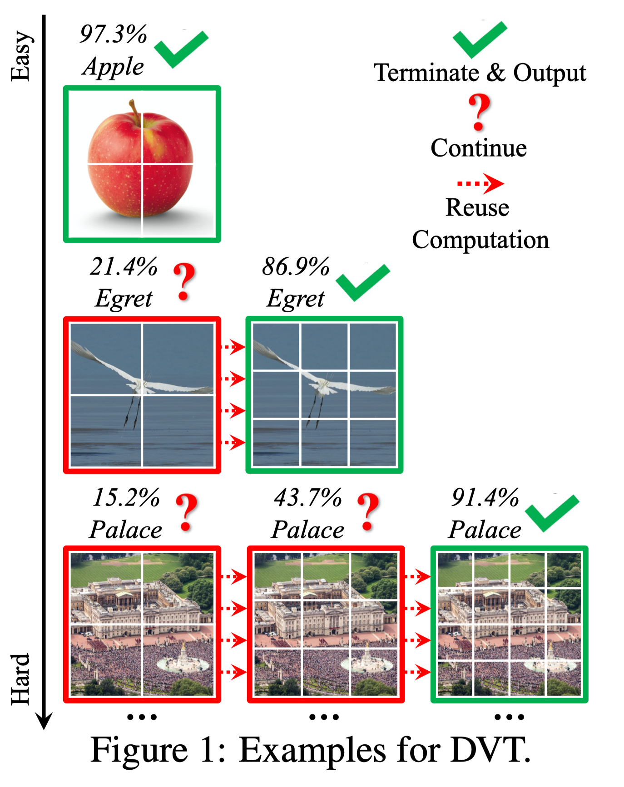
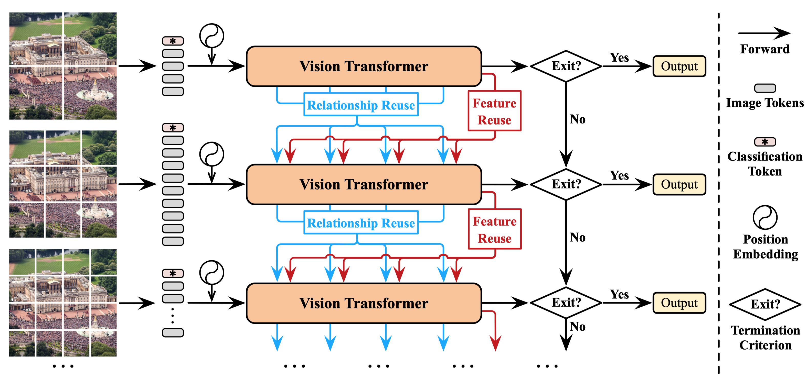
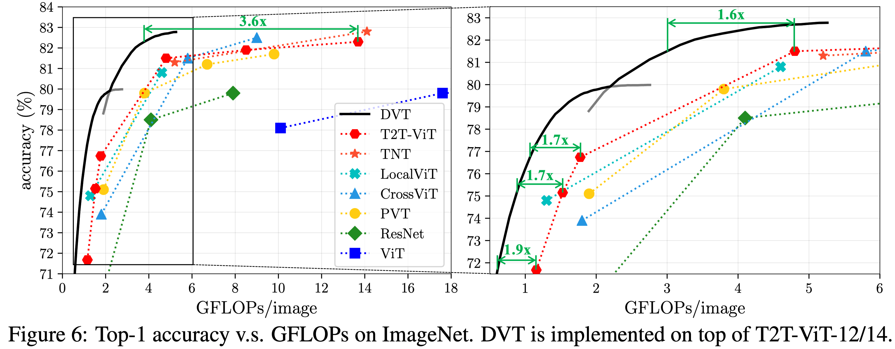
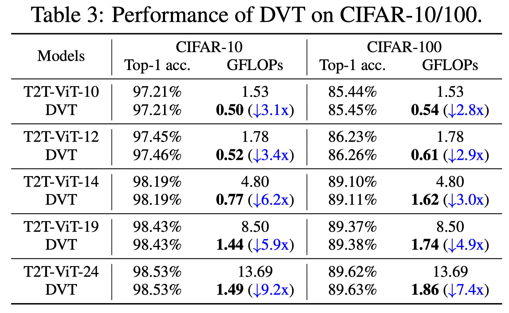
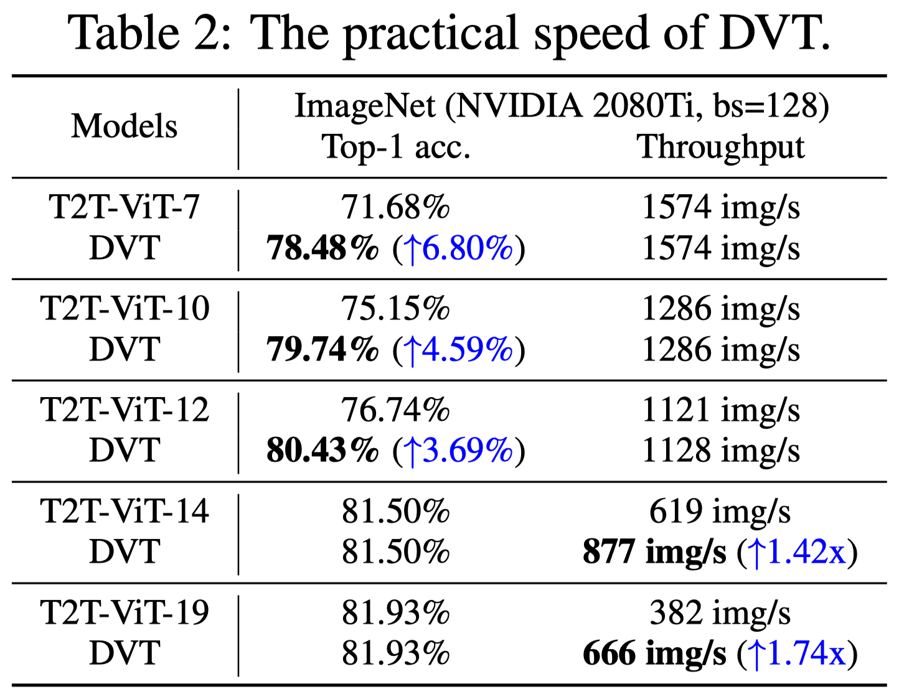
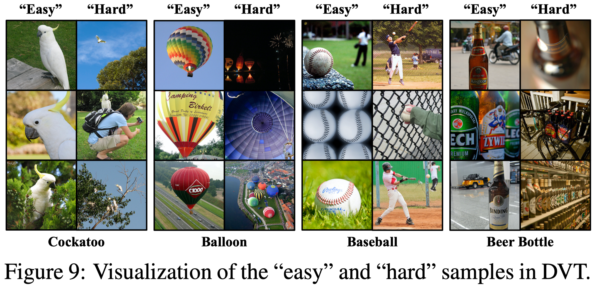

# Dynamic-Vision-Transformer (NeurIPS 2021)


This repo contains the official **PyTorch** code and pre-trained models for the Dynamic Vision Transformer (DVT).

- [Not All Images are Worth 16x16 Words: Dynamic Transformers for Efficient Image Recognition](https://arxiv.org/pdf/2105.15075.pdf)

We also provide an implementation under the **MindSpore** framework and train DVT on a cluster of **Ascend** AI processors. Code and pre-trained models will be available at [here](https://github.com/blackfeather-wang/Dynamic-Vision-Transformer-MindSpore).

**Update on 2021/10/02: Release the Training Code.**

**Update on 2021/06/01: Release Pre-trained Models and the Inference Code on ImageNet.**

## Introduction

<p align="center">
    
</p>

We develop a Dynamic Vision Transformer (DVT) to automatically configure a proper number of tokens for each individual image, leading to a significant improvement in computational efficiency,  both theoretically and empirically.
<p align="center">
    
</p>


## Citation

If you find this work valuable or use our code in your own research, please consider citing us with the following bibtex:

```
@inproceedings{wang2021not,
        title = {Not All Images are Worth 16x16 Words: Dynamic Transformers for Efficient Image Recognition},
       author = {Wang, Yulin and Huang, Rui and Song, Shiji and Huang, Zeyi and Huang, Gao},
    booktitle = {Advances in Neural Information Processing Systems (NeurIPS)},
         year = {2021}
}
```

## Results

- Top-1 accuracy on ImageNet v.s. GFLOPs 
<p align="center">
    
</p>


- Top-1 accuracy on CIFAR v.s. GFLOPs 
<p align="center">
    
</p>


- Top-1 accuracy on ImageNet v.s. Throughput 
<p align="center">
    
</p>


- Visualization
<p align="center">
    
</p>


## Pre-trained Models


|Backbone|# of Exits|# of Tokens|Links|
|-----|------|-----|-----|
|T2T-ViT-12| 3| 7x7-10x10-14x14|[Tsinghua Cloud](https://cloud.tsinghua.edu.cn/f/f7987d559f00435caa3d/?dl=1) / [Google Drive](https://drive.google.com/file/d/1-hu-OMWiwuc8iTd1PV-c8tv6jLZ8EVv9/view?usp=sharing)|
|T2T-ViT-14| 3| 7x7-10x10-14x14|[Tsinghua Cloud](https://cloud.tsinghua.edu.cn/f/afda2eec77c7491bbdaf/?dl=1) / [Google Drive](https://drive.google.com/file/d/1clxKfhbOP1oKBimzoTGogNSSljPHT5WB/view?usp=sharing)|
|DeiT-small| 3| 7x7-10x10-14x14|[Tsinghua Cloud](https://cloud.tsinghua.edu.cn/f/c415017423dd40ab8e72/?dl=1) / [Google Drive](https://drive.google.com/file/d/1oXDm1LbJhTRgJn3W_aWGV_6uGM3zpZib/view?usp=sharing)|

- What are contained in the checkpoints:

```
**.pth.tar
├── model_state_dict: state dictionaries of the model
├── flops: a list containing the GFLOPs corresponding to exiting at each exit
├── anytime_classification: Top-1 accuracy of each exit
├── dynamic_threshold: the confidence thresholds used in budgeted batch classification
├── budgeted_batch_classification: results of budgeted batch classification (a two-item list, [0] and [1] correspond to the two coordinates of a curve)

```

## Requirements
- python 3.7.10
- pytorch 1.8.1
- torchvision 0.9.1
- [apex](https://github.com/NVIDIA/apex)
- pyyaml

## Data Preparation
- The ImageNet dataset should be prepared as follows:
```
ImageNet
├── train
│   ├── folder 1 (class 1)
│   ├── folder 2 (class 1)
│   ├── ...
├── val
│   ├── folder 1 (class 1)
│   ├── folder 2 (class 1)
│   ├── ...

```
## Evaluate Pre-trained Models

- Read the evaluation results saved in pre-trained models
```
CUDA_VISIBLE_DEVICES=0 python inference.py --model {DVT_T2t_vit_12, DVT_T2t_vit_14, DVT_Deit_small} --checkpoint_path PATH_TO_CHECKPOINT  --eval_mode 0
```

- Read the confidence thresholds saved in pre-trained models and infer the model on the validation set
```
CUDA_VISIBLE_DEVICES=0 python inference.py --data_url PATH_TO_DATASET --batch_size 64 --model {DVT_T2t_vit_12, DVT_T2t_vit_14, DVT_Deit_small} --checkpoint_path PATH_TO_CHECKPOINT  --eval_mode 1
```

- Determine confidence thresholds on the training set and infer the model on the validation set
```
CUDA_VISIBLE_DEVICES=0 python inference.py --data_url PATH_TO_DATASET --batch_size 64 --model {DVT_T2t_vit_12, DVT_T2t_vit_14, DVT_Deit_small} --checkpoint_path PATH_TO_CHECKPOINT  --eval_mode 2
```

## Train
- Train DVT_T2t_vit_12/14 on ImageNet
```
CUDA_VISIBLE_DEVICES=0,1,2,3,4,5,6,7 python -m torch.distributed.launch --nproc_per_node=8 main.py PATH_TO_DATASET --model DVT_T2t_vit_12 --b 128 --lr 2e-3 --weight-decay .03 --amp --img-size 224
```
```
CUDA_VISIBLE_DEVICES=0,1,2,3,4,5,6,7 python -m torch.distributed.launch --nproc_per_node=8 main.py PATH_TO_DATASET --model DVT_T2t_vit_14 --b 64 --lr 5e-4 --weight-decay .05 --amp --img-size 224
```
- We use NVIDIA APEX AMP for efficient training. It would be ok to turn it off (by removing '--amp'). But the GPU memory cost will significantly increase.

## Transfer DVT to CIFAR-10/100
We finetune our pretrained DVT_T2t_vit_12/14 to CIFAR-10/100 in the same way as [T2T-ViT](https://github.com/yitu-opensource/T2T-ViT).

## Contact
This is a re-implementation version. If you have any question, please feel free to contact the authors. Yulin Wang: wang-yl19@mails.tsinghua.edu.cn.

## Acknowledgment
Our code of T2T-ViT is from [here](https://github.com/yitu-opensource/T2T-ViT). Our code of DeiT is from [here](https://github.com/facebookresearch/deitzhe). 

